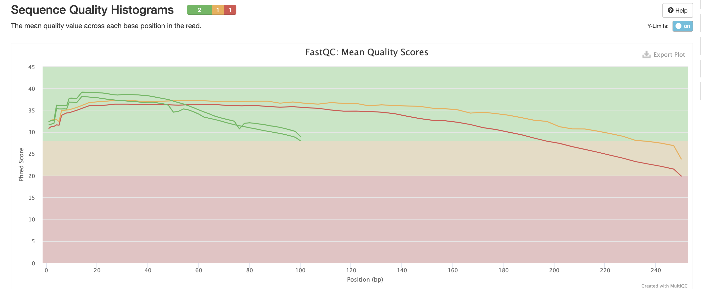

# Домашнее задание 1. Старостин Ярослав

## Ход выполнения задания

1. Создание символических ссылок на файлы
    ```bash
    ln -s /usr/share/data-minor-bioinf/assembly/oil_R1.fastq
    ln -s /usr/share/data-minor-bioinf/assembly/oil_R2.fastq
    ln -s /usr/share/data-minor-bioinf/assembly/oilMP_S4_L001_R1_001.fastq
    ln -s /usr/share/data-minor-bioinf/assembly/oilMP_S4_L001_R2_001.fastq
    ```
1. С помощью команды seqtk выбираем случайно 5 миллионов чтений типа paired-end и 1.5 миллиона чтений типа mate-pairs
    ```bash
    seqtk sample -s 915 oil_R1.fastq 5000000 > sample1.fastq
    seqtk sample -s 915 oil_R2.fastq 5000000 > sample2.fastq
    seqtk sample -s 915 oilMP_S4_L001_R1_001.fastq  1500000 > m1.fastq
    seqtk sample -s 915 oilMP_S4_L001_R2_001.fastq  1500000 > m2.fastq
    ```
1. Оценим качетсво
    - Создадим директории
        ```bash
        mkdir fastqc
        mkdir multiqc
        ```
    - Применим fastqc, чтобы оценить качество:
        ```bash
        fastqc -o fastqc m1.fastq 
        fastqc -o fastqc m2.fastq 
        fastqc -o fastqc sample1.fastq 
        fastqc -o fastqc sample2.fastq 
        ```
    - Применим multiqc, чтобы получить отчет:
        ```bash
        multiqc -o multiqc/ fastqc
        ```
        Отчет mutlqc до работы с чтениями
        
        
1. Удалим адаптеры и подготовим чтения:
    ```bash
    platanus_trim sample1.fastq sample2.fastq
    platanus_internal_trim m1.fastq m2.fastq
    ```
1. Оценим качетсво
    - Создадим директории
        ```bash
        mkdir fastqc_trimmed
        mkdir multiqc_trimmed
        ```
    - Применим fastqc, чтобы оценить качество:
        ```bash
        fastqc -o fastqc_trimmed/ sample1.fastq.trimmed sample2.fastq.trimmed 
        ```
    - Применим multiqc, чтобы получить отчет:
        ```bash
        multiqc -o multiqc_trimmed/ fastqc_trimmed
        ```
        Отчет mutlqc после работы с чтениями
        
        
1. Соберем контиги
    ```bash
    platanus assemble -o po -f sample1.fastq.trimmed sample2.fastq.trimmed 2>platanus_assemble_err.log -t 7
    ```
1. Соберем скаффолды
    ```bash
    platanus scaffold -o po -c po_contig.fa -IP1 sample1.fastq.trimmed sample2.fastq.trimmed  -OP2 m1.fastq.int_trimmed m2.fastq.int_trimmed -t 7 2> platanus_scaffold_err.log
    ```
1. Уменьшим количество гэпов
    ```bash
    platanus gap_close -o po -c po_scaffold.fa -IP1 sample1.fastq.trimmed sample2.fastq.trimmed -OP2 m1.fastq.int_trimmed m2.fastq.int_trimmed -t 7 2> platanus_gap_close_err.log
    ```
1. Почистим файлы:
    ```bash
    rm m1.fastq m2.fastq sample1.fastq
    rm sample*
    rm p*
    rm *.trimmed
    rm *.int_trimmed
    ```
1. Применим код, чтобы проанализировать контиги и скаффолды
    - Контиги
    ```bash
    cd src
    python3 contigs.py

    >>> Контиги:
    >>>     Количество контигов:             613
    >>>     Длина контигов:                  3938636
    >>>     Длина самого длинного контига:   179330
    >>>     N50:                             52821
    ```
    - Скаффолды
    ```bash
    python3 scaffolds.py
    
    >>> Скаффолды:
    >>>     Количество скаффолдов:                   66
    >>>     Длина скаффолдов:                        3875128
    >>>     N50:                                     3832081
    >>>     Длина самого длинного скаффолда:         3832081
    >>> Самый длинный скаффолд:
    >>> Количество гэпов:        61
    >>> Общая длина гэпов:       6557
    ```
    
## Результаты задания

Если проаналазировать графики `multiqc`, видно, что в результате работы над файлами качетсво выросло

